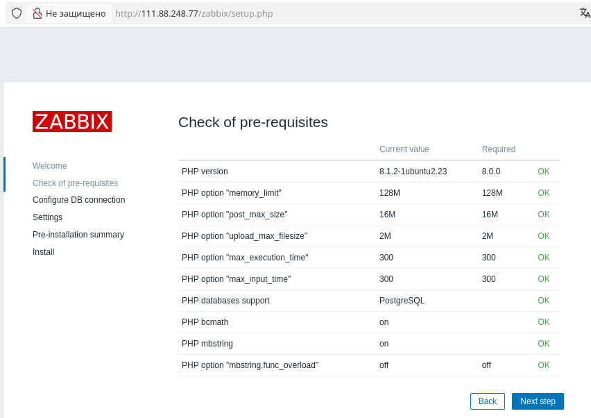
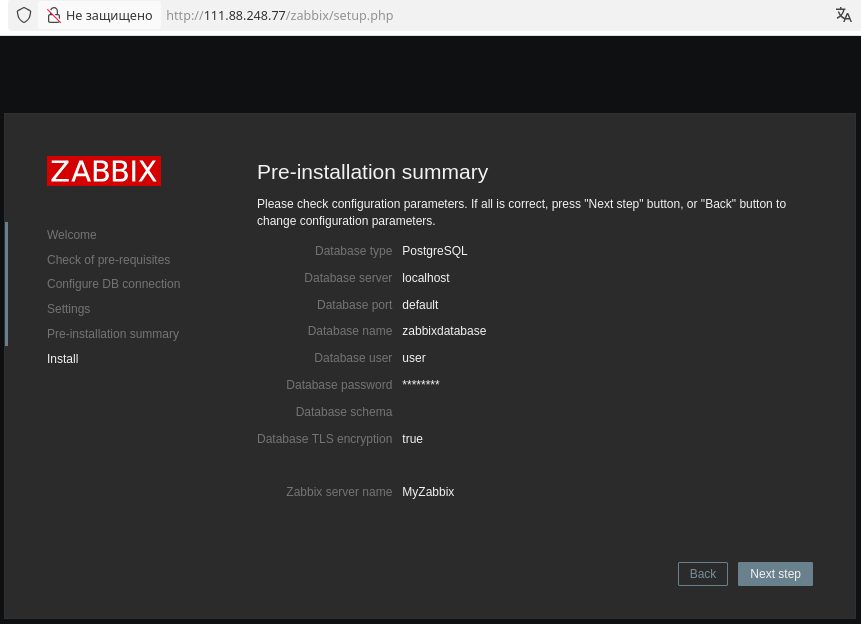
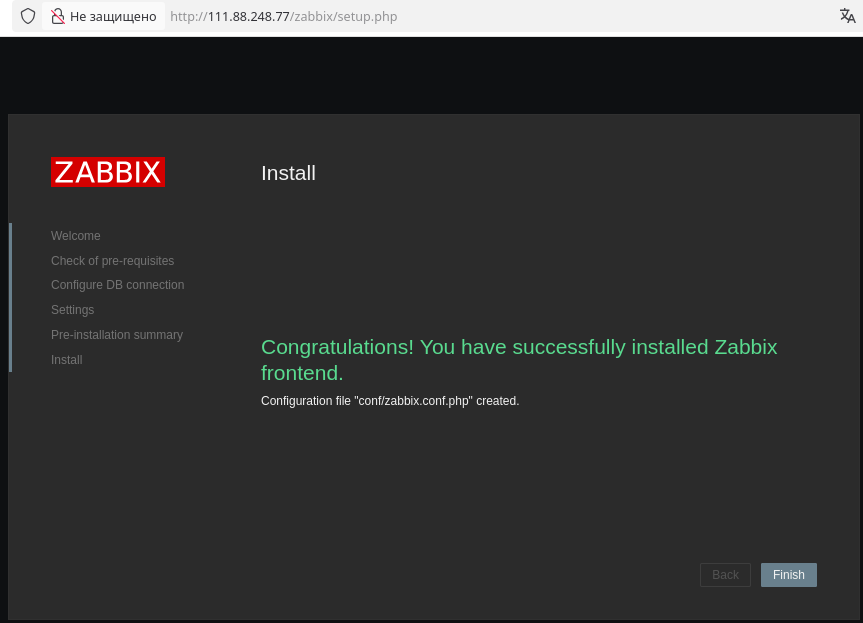
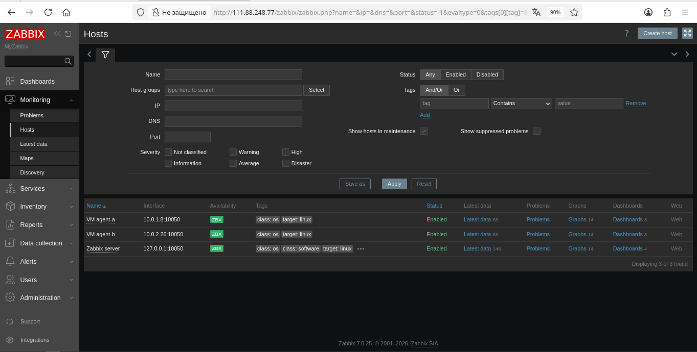
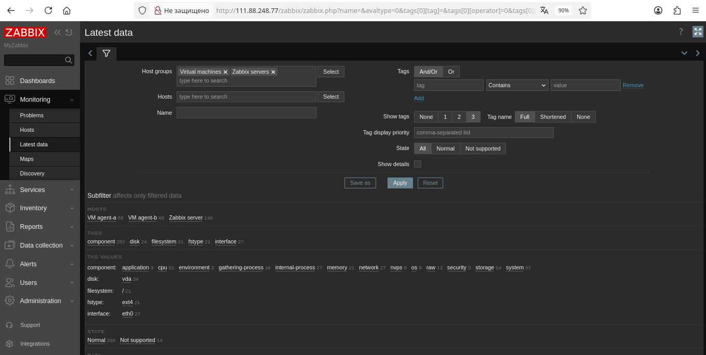
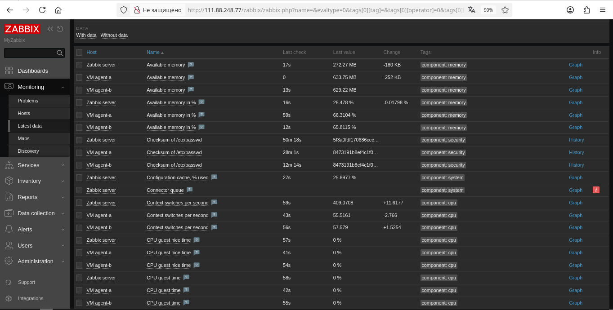
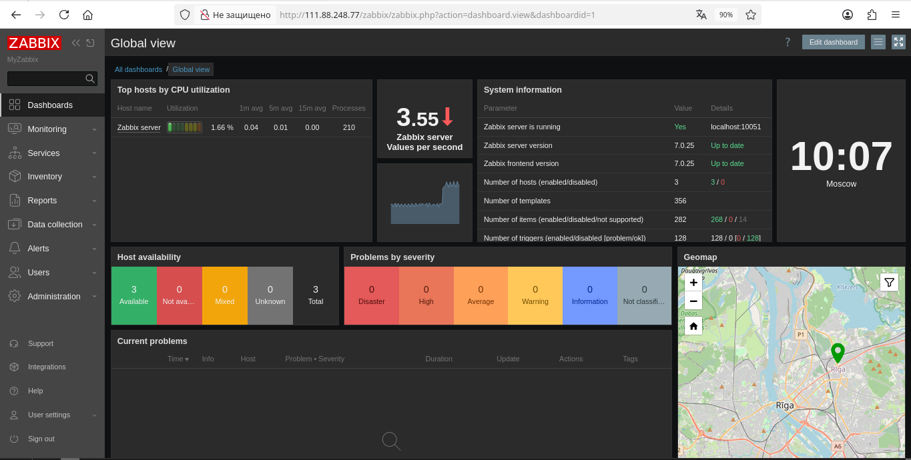
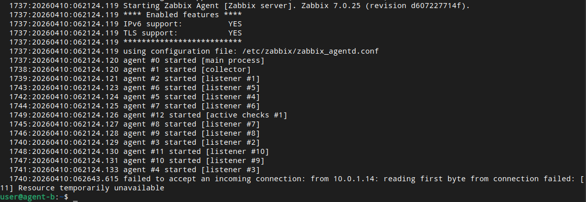

# Домашнее задание к занятию "Система мониторинга Zabbix" - Сергеев Александр


### Инструкция по выполнению домашнего задания

   1. Сделайте `fork` данного репозитория к себе в Github и переименуйте его по названию или номеру занятия, например, https://github.com/имя-вашего-репозитория/git-hw или  https://github.com/имя-вашего-репозитория/7-1-ansible-hw).
   2. Выполните клонирование данного репозитория к себе на ПК с помощью команды `git clone`.
   3. Выполните домашнее задание и заполните у себя локально этот файл README.md:
      - впишите вверху название занятия и вашу фамилию и имя
      - в каждом задании добавьте решение в требуемом виде (текст/код/скриншоты/ссылка)
      - для корректного добавления скриншотов воспользуйтесь [инструкцией "Как вставить скриншот в шаблон с решением](https://github.com/netology-code/sys-pattern-homework/blob/main/screen-instruction.md)
      - при оформлении используйте возможности языка разметки md (коротко об этом можно посмотреть в [инструкции  по MarkDown](https://github.com/netology-code/sys-pattern-homework/blob/main/md-instruction.md))
   4. После завершения работы над домашним заданием сделайте коммит (`git commit -m "comment"`) и отправьте его на Github (`git push origin`);
   5. Для проверки домашнего задания преподавателем в личном кабинете прикрепите и отправьте ссылку на решение в виде md-файла в вашем Github.
   6. Любые вопросы по выполнению заданий спрашивайте в чате учебной группы и/или в разделе “Вопросы по заданию” в личном кабинете.
   
Желаем успехов в выполнении домашнего задания!
   
### Дополнительные материалы, которые могут быть полезны для выполнения задания

1. [Руководство по оформлению Markdown файлов](https://gist.github.com/Jekins/2bf2d0638163f1294637#Code)

---

### Задание 1

ДЗ выполнил на трех ВМ Ubuntu 22.04, развернутых в Yandex Cloud через манифесты terraform и ansible.
Первую ВМ (с публичным адресом) с именем bastion планировал как сервер Zabbix, две другие одинаковые ВМ (за NAT)
с именами agent-a и agent-b планировал как агенты Zabbix.

1. Выполнял ДЗ согласно записи лекции.

2. Выполнял ДЗ согласно инструкции
https://www.zabbix.com/ru/download?zabbix=7.0&os_distribution=ubuntu&os_version=22.04&components=server_frontend_agent&db=pgsql&ws=apache
для входных данных: Zabbix 7.0 LTS, Ubuntu 22.04 (Jammy), Server+FrontEnd+Agent, PostgreSQL, Apache.

Подготовил файл плейбука "install_postgres.yml" для установки postgresql на сервере ВМ bastion, создания пользователя user,
создания БД zabbixdatabase. Выполнил плейбук на локальном компьютере:
```
ansible-playbook install_postgres.yml
```

3. Пользуясь конфигуратором команд с официального сайта, выполнил команды для установки последней версии (LTS) Zabbix
с поддержкой PostgreSQL и Apache:

С локального компьютера подключился ssh-терминалом к ВМ bastion:
```
ssh user@111.88.248.77
```

Настроил на ВМ использование репозитория Zabbix:
```
sudo wget https://repo.zabbix.com/zabbix/7.0/ubuntu/pool/main/z/zabbix-release/zabbix-release_latest_7.0+ubuntu22.04_all.deb
sudo dpkg -i zabbix-release_latest_7.0+ubuntu22.04_all.deb
sudo apt update
```

4. Установил на ВМ сервер Zabbix, веб-интерфейс и агент:
```
sudo apt install zabbix-server-pgsql zabbix-frontend-php php8.1-pgsql zabbix-apache-conf zabbix-sql-scripts zabbix-agent
```

Импортировал начальную схему и данные БД:
```
sudo zcat /usr/share/zabbix-sql-scripts/postgresql/server.sql.gz | sudo -u user psql zabbixdatabase
```

Настроил базу данных для сервера Zabbix - определил расположение файла конфигурации zabbix_server.conf и указал в
нем свои реквизиты (имя БД, имя и пароль пользователя): 
```
sudo find / -name "zabbix_server.conf"
sudo sed -i 's/DBName=zabbix/DBName=zabbixdatabase/g' /etc/zabbix/zabbix_server.conf
sudo sed -i 's/DBUser=zabbix/DBUser=user/g' /etc/zabbix/zabbix_server.conf
sudo sed -i 's/# DBPassword=/DBPassword=12345678/g' /etc/zabbix/zabbix_server.conf
sudo nano /etc/zabbix/zabbix_server.conf
```

Перезапустил процессы сервера Zabbix и настроил их запуск при загрузке ОС:
```
sudo systemctl restart zabbix-server zabbix-agent apache2
sudo systemctl enable zabbix-server zabbix-agent apache2
sudo systemctl status zabbix-server
```

Открыл веб-интерфейс сервера Zabbix на http://111.88.248.77/zabbix и проверил, что все опции для
установки обозначены как OK, закончил установку веб-интерфейса:








---

### Задание 2

1. Выполнял ДЗ согласно записи лекции.

2. Установил Zabbix Agent на две ВМ (agent-a и agent-b) по инструкции
https://www.zabbix.com/ru/download?zabbix=7.0&os_distribution=ubuntu&os_version=22.04&components=agent&db=&ws=
для входных данных: Zabbix 7.0 LTS, Ubuntu 22.04 (Jammy), Agent

С локального компьютера подключился ssh-терминалом к ВМ agent-a и agent-b:
```
ssh user@10.0.1.8 -J user@111.88.248.77
ssh user@10.0.2.26 -J user@111.88.248.77
```

Настроил использование репозиторий Zabbix:
```
sudo wget https://repo.zabbix.com/zabbix/7.0/ubuntu/pool/main/z/zabbix-release/zabbix-release_latest_7.0+ubuntu22.04_all.deb
sudo dpkg -i zabbix-release_latest_7.0+ubuntu22.04_all.deb
sudo apt update
```

Установил Zabbix агент:
```
sudo apt install zabbix-agent
```

3. Определил адрес ВМ bastion во внутренней сети (10.0.1.14):
```
ssh user@111.88.248.77
ip a
```

Включил адрес Zabbix Server в разрешенные серверы в конфигурации агента Zabbix:
```
sudo find / -name "zabbix_agentd.conf"
sudo sed -i 's/Server=127.0.0.1/Server=10.0.1.14/g' /etc/zabbix/zabbix_agentd.conf
sudo sed -i 's/ServerActive=127.0.0.1/ServerActive=10.0.1.14/g' /etc/zabbix/zabbix_agentd.conf
sudo nano /etc/zabbix/zabbix_agentd.conf
```

Перезапустил процесс агента Zabbix и настроил его запуск при загрузке ОС:
```
sudo systemctl restart zabbix-agent
sudo systemctl enable zabbix-agent
systemctl status zabbix-agent
```

В ssh-терминале ВМ bastion (10.0.1.14) проверил доступность портов 10050 ВМ agent-a и agent-b:
```
telnet 10.0.1.8 10050
telnet 10.0.2.26 10050
```
В ssh-терминалах ВМ agent-a (10.0.1.8) и agent-b (10.0.2.26) проверил доступность порта 10051 ВМ bastion:
```
telnet 10.0.1.14 10051
```

4. В веб-интерфейсе сервера Zabbix http://111.88.248.77/zabbix вручную добавил агентов Zabbix в разделе Monitoring > Hosts



5. Проверил, что в разделе Monitoring/Latest Data начали появляться данные с добавленных агентов:







Скриншот лога zabbix agent, где видно, что он работает с сервером:


